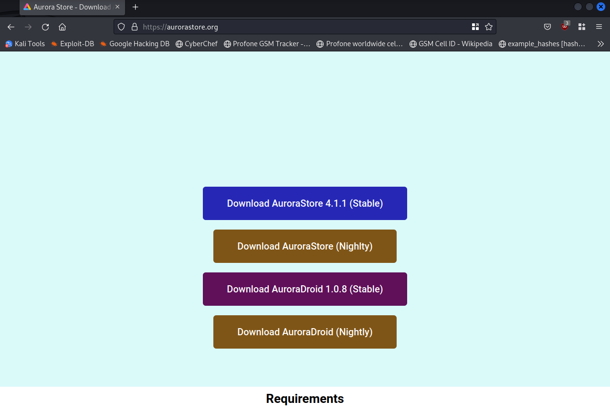
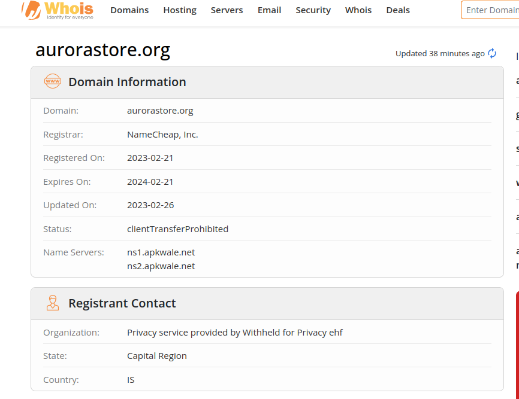

+++
author = "Collin"
title = "ALERT Fake aurora store phishing"
description = "A fake website is pretending to be aurora store to get you to download an apk file"
date = 2023-11-16
+++

## Fake Website Found

The website found at https://aurorastore.org/ is not the real website for Aurora store and should be avoided.

## How can you tell?

There are many red flags for this website

1. Incorrect spelling for Nightly

2. The domain was created this year while the project is much older

3. The gitlab repo of the project never links to this site.

## Questions

I tried to download the apk on my vm to scan it but found something odd. The link was to the actual Aurora store apk downloads. The links didn't work because they were referring to old versions. While it links to the real site for downloading the apk right now, it could easily have linked to malicious apks prior to me finding this website.

## Where to find the real website?

The best place to look is on the [gitlab repo](https://gitlab.com/AuroraOSS/AuroraStore) or on [fdroid](https://f-droid.org/packages/com.aurora.store/)

## How to report the website?

If you want to report the website for phishing, you can go to the domain registrar for the site and submit a ticket. The registrar for this website is [namecheap.com](https://www.namecheap.com/) and the link to creating a ticket is [here.](https://support.namecheap.com/index.php?/Tickets/Submit)
